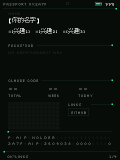
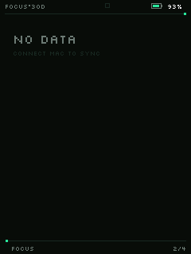
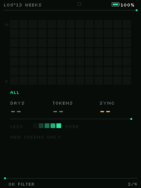
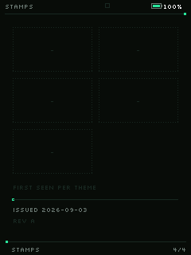

# 用量监控 · 设计概念

> 来源：对社区固件 **FoloToy AI Passport「本护照」**（`ai-passport-5`，作者 york_Z）的逆向与实测。
> 目标：把它的设计语言提炼成规范，落到本仓库的 `usage-monitor` 固件上。
> 日期：2026-10-06

---

## 0. 为什么要学它

在一众 token 用量固件里，这本「护照」是**最适合 240×320 这块屏**的一版。原因不是它元素多，而是它**极克制**：

- 全屏 **16 色索引**（`240×320×4bit = 38,400 B`），C3 无 PSRAM 也放得下
- 主色只占 **0.11%** 的像素
- 全屏 **只有 3 档字号 + 1 个强调色**
- 四页布局**完全同构**，换页时只有内容区变

一句话：**它把"约束"变成了"风格"**。

### 参考图

四页截图（设备帧缓冲原始像素）在 `docs/assets/passport-ui/`：

| 页面 | 图 |
| --- | --- |
| 1/4 资料页 |  |
| 2/4 焦点页 |  |
| 3/4 日志页 |  |
| 4/4 章页 |  |

> 第 2 页很空是因为设备未同步数据（`NO DATA`）。
> 另有官方封面的高清渲染图 `assets/passport-ui/cover-official-hd.webp`（900×1200，第 1 页）。
> 抓取方式见 `docs/assets/passport-ui/README.md`。

---

## 1. 设计原则（提炼）

| # | 原则 | 落地做法 |
| --- | --- | --- |
| 1 | **先定语义，再分色位** | 16 色 = 6 结构 + 4 梯度 + 6 分类，不是"挑好看的颜色" |
| 2 | **主色即状态** | 薄荷绿只表示"正在发生"：焊点、今天、活动项 |
| 3 | **形式与内容同源** | 护照 → 电路板：走线=分隔、丝印=文字、焊点=状态 |
| 4 | **靠留白而非花哨** | 背景占 ~90%，靠明度阶梯做纵深 |
| 5 | **无数据也保持骨架** | 空态只换内容区，布局不塌 |
| 6 | **像素化即清晰** | 1px 线 + 像素字，低 DPI 上永远锐利 |

---

## 2. 配色规范

### 16 色调色板

| # | 色值 | 名称 | 角色 |
| --- | --- | --- | --- |
| 0 | `#0B0E0D` | 底 | 背景（电路板黑绿）|
| 1 | `#121614` | 面 | 次级面（块/格）|
| 2 | `#1F2A24` | 走线 | 1px 分隔线 |
| 3 | `#6B7A72` | 丝印灰 | 次要文字 |
| 4 | `#F2F5F3` | 丝印白 | 主文字 |
| 5 | `#2EE59D` | 薄荷绿 | **主色 / 正常 / 活动** |
| 6 | `#5B9BFF` | 蓝 | 分类色 |
| 7 | `#4AF0D6` | 青 | 分类色 |
| 8 | `#144431` | 绿 L1 | 梯度最暗 |
| 9 | `#1C7A55` | 绿 L2 | |
| 10 | `#25AF79` | 绿 L3 | |
| 11 | `#FFB454` | 琥珀 | **警戒（≥70%）** |
| 12 | `#FF5C5C` | 红 | **危险（≥90%）** |
| 13 | `#7B5CFF` | 紫 | 分类色 |
| 14 | `#7A5320` | 棕 | 分类色 |
| 15 | `#000000` | 黑 | 纯黑 |

> 相对原版：去掉了重复的薄荷绿，补了一个红色给"危险"档 —— 用量监控必须有三级告警。

### 用法规则

```
结构色(0-4)  永远只做骨架：背景、面、线、次要字、主字
主色(5)      只给"正在发生"：焊点、活动平台指示、正常用量
告警(11,12)  只给用量档位：<70% 薄荷 / ≥70% 琥珀 / ≥90% 红
分类(6,7,13,14) 给多平台区分（可选）
```

**禁忌**：不要用颜色区分"层级"（层级用字号和留白），颜色只表达"语义"。

---

## 3. 网格与母题

### 画布

```
240 × 320 · 边距 左右 6px / 上下 4px · 内容宽 228
外框顶线 y=17 · 底线 y=303
```

### 电路板丝印母题

```
走线   = 1px 高的分隔线（#1F2A24）
焊点   = 4×4 的薄荷绿方块，焊在走线右端
丝印   = 所有文字
```

分隔线 + 右端焊点，是整套界面的**视觉锚点**，每一段都重复它。

### 版式骨架（四页同构）

```
页眉   大写标题（左）          状态（右）
──────────────────────────●   ← 走线 + 焊点
内容区 数据驱动
──────────────────────────●
页脚   操作提示               页码 n/N
```

---

## 4. 字体层级

只有 3 档，**层级靠位置和留白，不靠字号堆叠**：

| 档 | 字号 | 用途 | 风格 |
| --- | --- | --- | --- |
| 大字 | Montserrat 28 | 平台名 / 关键数值 | 白色 |
| 中字 | Montserrat 20 | 百分比 / 窗口标题 | 按语义着色 |
| 小字 | Montserrat 14 | 大写标签、页眉、页脚 | 灰色 + 字距 |
| 中文 | vn_font_16 | 中文标签与明细 | 灰/白 |

---

## 5. usage-monitor 的页面结构

沿用原固件的交互（上下切平台 / 确定切详情 / 长按刷新），但重排版面：

```
┌─ 页眉 ────────────────────────────────┐
│ USAGE MONITOR              ● 正常 12:34│   ← 小字；状态点用主色/琥珀/红
├───────────────────────────────────●───┤   ← 走线 + 焊点
│                                        │
│ OpenCode Go                   1/3      │   ← 大字平台名 + 页码
│                                        │
│ ──────────────────────────────────●    │
│ 滚动                          65%      │   ← 标签 + 大字百分比
│ ▓▓▓▓▓▓▓▓▓▓▓▓░░░░░░░░░░░░░░░░░░         │   ← 进度条（按档位着色）
│ 42分后重置                             │   ← 小字
│                                        │
│ ──────────────────────────────────●    │
│ 每周                          30%      │
│ ▓▓▓▓▓▓░░░░░░░░░░░░░░░░░░░░░░░░         │
│ 3天后重置                              │
│                                        │
├───────────────────────────────────●───┤
│ 上下切平台  确定详情  长按刷新    1/3   │
└────────────────────────────────────────┘
```

### 视图切换

| 视图 | 第三行显示 |
| --- | --- |
| 概览 | `42分后重置`（本地格式化）|
| 详情 | 服务端给的明细文本（如 `1.3M / 2M tokens`）|

服务端只管给文本，设备只管排版 —— 换数据源不用改界面。

---

## 6. 空态与异常态

**空态也要保持骨架**（学自原版）：

```
USAGE MONITOR                    ● 无网络
──────────────────────────────●
        NO DATA
        正在获取用量…
──────────────────────────────●
```

**状态色**：

```
正常   薄荷绿 #2EE59D
刷新中 蓝     #5B9BFF
离线   红     #FF5C5C
```

---

## 7. 实现清单

| 项 | 位置 |
| --- | --- |
| 调色板 / 网格 / 母题 | `firmware/usage-monitor/main/usage_ui.c` |
| 字体（Montserrat 14/20/28 + vn_font_16）| `sdkconfig.defaults` |
| 数据模型（不改）| `usage_model.c/.h` |
| 取数（不改）| `usage_net.c/.h` |
| 交互（不改）| `usage_app.c` |

---

## 8. 和原版的取舍

| 原版做法 | 本固件做法 | 原因 |
| --- | --- | --- |
| 16 色索引帧缓冲 | 直接 RGB565 绘制 | LVGL 直绘，无需整屏缓冲 |
| 自定义像素字 | Montserrat + vn_font_16 | 仓库已有字体，不额外引入 |
| 4 页（资料/焦点/日志/章）| 1 页多平台 + 概览/详情 | 用量监控的数据模型不同 |
| 13 周热力图 | 保留（若服务端给日粒度数据）| 二期可选 |

**保留的核心**：调色板、网格、丝印母题、3 档字号、无数据骨架、主色语义。
